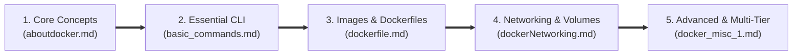
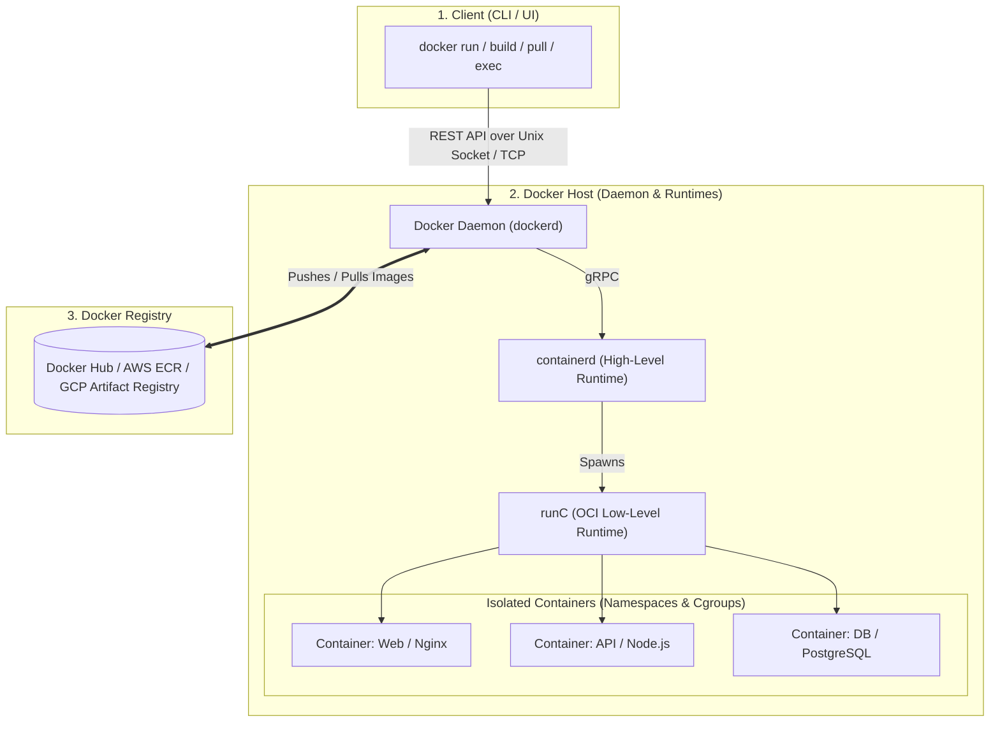

# 🐳 Complete Docker & Containerization Guide

[](https://www.docker.com/)
[](https://www.kernel.org/)
[](#)
[](LICENSE)

A structured, comprehensive, and production-grade guide covering everything from Docker fundamentals and virtualization internals to advanced Dockerfile optimization, storage drivers, networking segmentation, secrets management, and multi-tier architectures.

---

## 📚 Repository Modules & Roadmap

This repository is organized into targeted modules designed to take you from foundational concepts to production-level DevOps engineering:



| Module | Document | Core Topics Covered |
| :--- | :--- | :--- |
| **01. Foundations** | [📘 `aboutdocker.md`](./aboutdocker.md) | Virtualization vs. Containerization, Hypervisors, Docker Client-Daemon Architecture (`dockerd`, `containerd`, `runC`), Image Registries, Image vs Container comparison. |
| **02. Command Line** | [💻 `basic_commands.md`](./basic_commands.md) | Image lifecycle (`pull`, `images`, `rmi`), Container lifecycle (`create`, `start`, `stop`, `run`, `exec`, `rm`), debugging (`logs`, `inspect`, `prune`). |
| **03. Image Building** | [🛠️ `dockerfile.md`](./dockerfile.md) | Dockerfile instructions (`FROM`, `RUN`, `CMD`, `WORKDIR`, `EXPOSE`, `ENV`), Image layer caching, UnionFS, Build-time vs Runtime phases. |
| **04. Network & Storage** | [🌐 `dockerNetworking.md`](./dockerNetworking.md) | Docker software bridges (`docker0`), network segmentation, persistent named volumes, storage drivers, and data isolation. |
| **05. Advanced DevOps** | [🚀 `docker_misc_1.md`](./docker_misc_1.md) | Container resource inspection (`lscpu`, `df -h`, `docker stats`), `-i` vs `-t` flags, batch cleanup scripts, single-file vs directory bind mounts, port mapping, secrets management (MySQL case study), and multi-tier production architecture. |

---

## 🏛️ High-Level Docker Architecture

Docker utilizes a client-server architecture. The **Docker Client** speaks to the **Docker Daemon (`dockerd`)**, which handles the heavy lifting of building, running, and distributing your containers.



---

## ⚡ Quick Reference Cheat Sheet

### 1. Managing Containers
```bash
# Run a detached container with custom name and port forwarding
docker run -d --name my-web -p 8080:80 nginx:alpine

# Execute an interactive shell inside a running container
docker exec -it my-web /bin/sh

# View container logs in real time
docker logs -f my-web

# List all containers with resource consumption
docker stats
```

### 2. Managing Images & Builds
```bash
# Build an image with a specific tag using current directory context
docker build -t my-app:1.0.0 .

# List local images
docker images

# Remove unused/dangling images
docker image prune -a
```

### 3. Networks & Volumes
```bash
# Create a dedicated isolated network
docker network create app-network

# Create a persistent named volume
docker volume create app-db-data

# Run container attached to custom network and volume
docker run -d \
  --name postgres-db \
  --network app-network \
  -v app-db-data:/var/lib/postgresql/data \
  -e POSTGRES_PASSWORD=mysecret \
  postgres:15-alpine
```

### 4. Bulk Cleanup (Dev & CI/CD)
```bash
# Stop and force-remove all containers
docker rm -f $(docker ps -a -q)

# Nuclear cleanup (stopped containers, unused networks, dangling images, cache)
docker system prune -af --volumes
```

---

## 🛡️ Production & DevOps Best Practices

> [!TIP]
> **Layer Caching Optimization**  
> Order your `Dockerfile` instructions from least frequently changed to most frequently changed. Always copy package dependency files (e.g. `package.json`, `requirements.txt`, `go.mod`) and install dependencies *before* copying the remaining application source code.

> [!IMPORTANT]
> **Least Privilege & Security**  
> Avoid running containers as `root`. Use `USER nonroot` or create a dedicated application user inside your `Dockerfile`.

> [!WARNING]
> **Secrets Management**  
> Never bake API keys, private certificates, or database passwords into images (`ENV` or `ARG`) or pass them as plaintext CLI arguments. Use Docker Secrets, mounted files (`_FILE` convention), or secret management engines (e.g. AWS Secrets Manager, HashiCorp Vault).

---

## 🤝 Contributing & License

Contributions, improvements, and real-world DevOps examples are welcome!
This project is open-source and available under the [MIT License](LICENSE).
