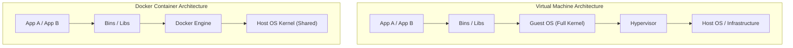
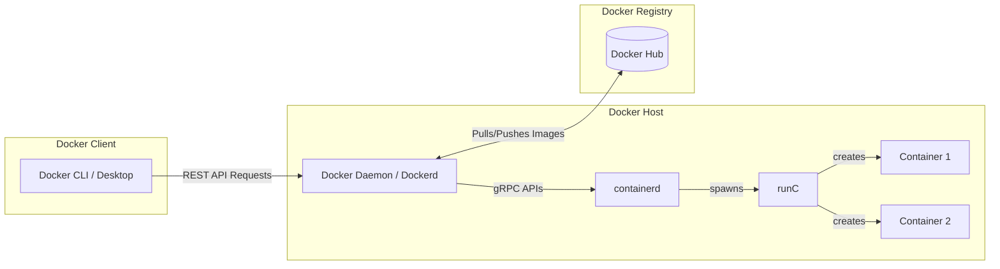

o# Introduction to Docker and Virtualization

## Why Docker?
Docker solves several critical problems in software development and deployment:

1. **Environment Reproducibility**: "It works on my machine" is no longer an issue. Docker packages the application along with its exact system configuration, environment variables, libraries, and binaries. Everyone (developers, QA, production servers) runs the exact same environment.
2. **Dependency Management**: Isolates application dependencies. You can run multiple applications with conflicting dependencies on the same host machine without them interfering with each other.
3. **Portability**: Containers run consistently on any system that supports Docker—whether it's a developer's Windows laptop, a macOS workstation, a Linux staging server, or a cloud platform like AWS/GCP.
4. **Version Control: HOW?**
   - **Dockerfile as Code**: Docker configurations are defined in a plain text file called a `Dockerfile`. This file can be tracked in Git just like source code, providing a clear history of how the environment evolved.
   - **Docker Image Tags**: Docker images can be tagged with version numbers (e.g., `myapp:1.0.0`, `myapp:latest`). This allows you to roll back to a specific previous state of your environment instantly.
   - **Layered File System (UnionFS)**: Docker images are built using layers. Each instruction in a `Dockerfile` creates a new layer. If you change a line, Docker only rebuilds that layer and subsequent layers, tracking changes incrementally and saving storage.

---

## Servers

### Definition
A **Server** can refer to both hardware and software:
- **Physical Server (Hardware)**: A powerful computer connected to a network that stores data and runs applications, designed to be highly reliable and run 24/7.
- **Software Server**: A program or service that listens for incoming network requests (like HTTP requests from a browser) and sends back responses (like web pages or API data).

### Scaling Servers
When user traffic increases, servers must scale to handle the load:
- **Vertical Scaling (Scaling Up)**: Adding more resources (CPU, RAM, Storage) to a single existing server. It has hardware limits and introduces a single point of failure.
- **Horizontal Scaling (Scaling Out)**: Adding more server instances to share the workload, typically managed by a load balancer. This is highly resilient and virtually limitless.

### Runtimes & Isolation Issues
Multiple applications often run on the same physical/virtual server. If App A requires Node.js v14 and App B requires Node.js v20, installing both globally can cause severe runtime conflicts. 

To resolve this, we historically used **Virtualization**:
- **Virtualization**: Technology that allows one physical computer to behave as multiple independent computers called **Virtual Machines (VMs)**.
- **Hypervisor**: The software (e.g., VMware, VirtualBox, Hyper-V) that sits between the physical hardware and the VMs, creating, running, and managing the guest operating systems.

---

## How and Why Containers are Faster than VMs

Containers are significantly faster, lighter, and more resource-efficient than Virtual Machines because of their architectural differences:

### Key Differences

| Feature | Virtual Machines (VMs) | Docker Containers |
| :--- | :--- | :--- |
| **OS Architecture** | Each VM includes a complete **Guest OS** (kernel, device drivers, system services). | Containers **share the host OS kernel** and only package applications and user-space libraries. |
| **Virtualization Level** | Virtualizes physical hardware via a Hypervisor. | Virtualizes the Host Operating System (Process Isolation). |
| **Startup Time** | **Minutes**: Needs to boot a full guest operating system. | **Milliseconds to Seconds**: Simply starting a sandboxed process on the host. |
| **Resource Usage** | **High (Gigabytes)**: Each VM reserves CPU, RAM, and disk space for its Guest OS. | **Low (Megabytes)**: Runs as a native process, sharing resources dynamically with the host. |
| **Isolation** | Hard hardware-level isolation (more secure, but heavier). | Process-level isolation using Linux kernel features (`namespaces` and `cgroups`). |

### Why Containers are Faster:
1. **No Guest OS Boot Time**: Because a container does not have to boot its own operating system kernel, starting a container is as fast as starting a normal application process on your computer.
2. **Direct Hardware Execution**: Hypervisors must translate instruction calls from the Guest OS to the Host OS, creating overhead. Containers execute instructions directly on the host kernel, yielding near-native performance.
3. **Optimized Storage**: Containers share base image layers (using Copy-on-Write storage), meaning spinning up 10 containers of the same image takes barely any extra disk space, whereas 10 VMs would require 10 copies of the entire operating system.

## Containers

A **Container** is a lightweight, executable, and standalone package of software that includes everything needed to run an application: code, runtime, system tools, system libraries, and settings.

Key characteristics:
1. **Shared OS Kernel**: Unlike VMs, containers share the host machine's OS kernel, meaning they don't require a full OS per application, significantly reducing overhead.
2. **Process Isolation**: Containers are completely isolated from one another and the host system, ensuring security and stability.
3. **Speed**: They boot up in milliseconds since there is no OS to boot.
4. **Portability**: They run consistently across any environment, eliminating the "it works on my machine" problem.
5. **Scalability**: Because they are lightweight, you can easily spin up hundreds of containers across a cluster of machines.

*Note: We use a `Dockerfile` to create an image, and running that image creates a container based on our requirements.*

## What is the difference between an Image and a Container?

- **Docker Image**: Think of an image as a **blueprint** or a class in object-oriented programming. It is a read-only, immutable template containing instructions for creating a Docker container. It packages the application code, runtime, libraries, and environment variables.
- **Docker Container**: Think of a container as a **running instance** of that blueprint (or an object instantiated from a class). When you execute a `docker run` command on an image, it becomes a container. You can spin up multiple isolated containers from a single image simultaneously.

DOCKER-
A software program that lets us build images, run, manage and distributes them efficiently using containers.
    -Docker client lets the users/dev to interact with the docker on cli or desktop app to run commands like: docker pull, docker run, docker build, etc.

    -Docker host is the virtual machine or the server on which the docker engine is installed and running.

DOCKER IMAGE-
These are read only binary templates used to build containers. Any number of containers can be built using these images.
    They contain the application code, libraries, dependencies required to run the code.

DOCKER DAEMON-
The heart of the docker. The actual component that listens to the APIs(from the docker client) and builds and manages the images, networks and volumes.
It is more like a middleman between client and host. It also pull the images from the registries as per requirements by the client.

### Docker Registry
A **Docker Registry** is a centralized storage and distribution system for named Docker images. 
- **Docker Hub** is the default public registry provided by Docker, offering access to thousands of official base images (like Ubuntu, Nginx, Node.js, Python).
- You can also set up private registries (e.g., AWS ECR, Google Artifact Registry) to securely store and manage proprietary company images.

HOW DOCKER WORKS-
Docker CLI(client) communicates with Docker Daemon/server named 'Dockerd'.
It processes the API request and utilized the containered functionality to manage the container's lifecycle, named 'containerd'.
runC component is used to run the containers.

### Diagram: How Docker Works

- **Client (CLI)**: The user interface where you type commands like `docker run` or `docker build`.
- **Daemon (Dockerd)**: The core engine that receives API requests, manages images, volumes, and networks.
- **containerd**: An industry-standard container runtime that manages the complete container lifecycle (pulling/pushing images, execution, stopping).
- **runC**: A low-level, lightweight tool that directly interfaces with Linux kernel features (`cgroups`, `namespaces`) to actually spawn and run the isolated containers.

