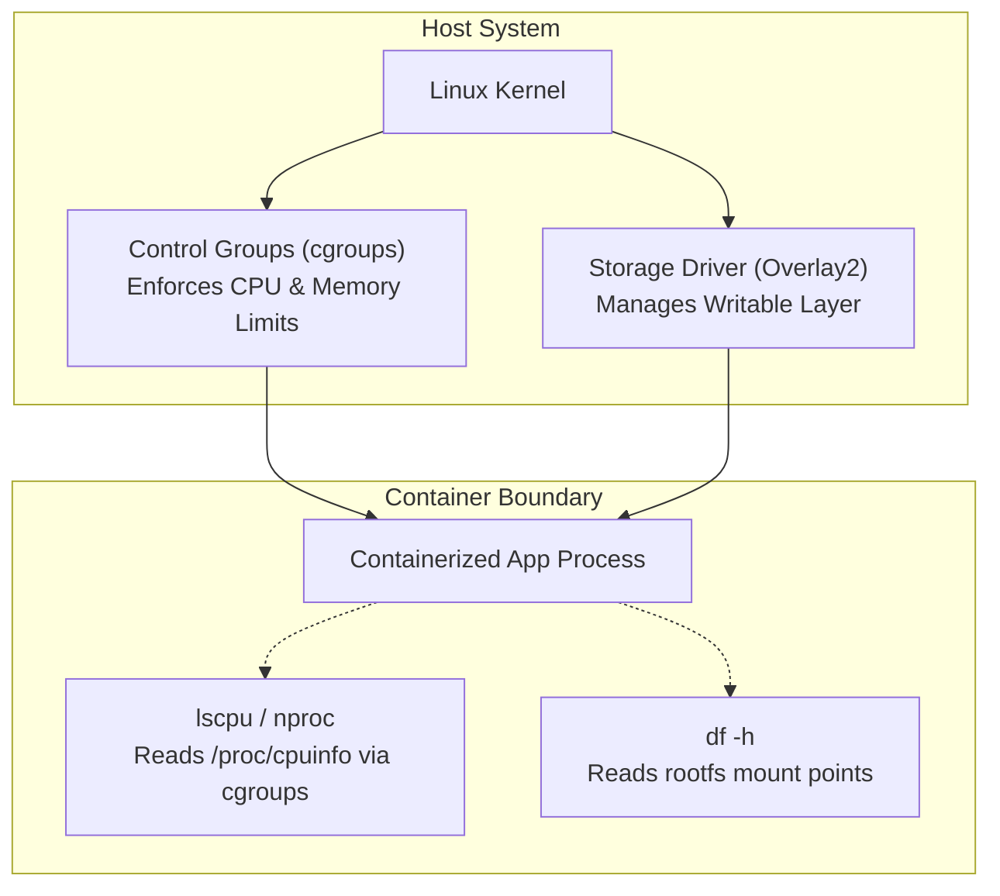
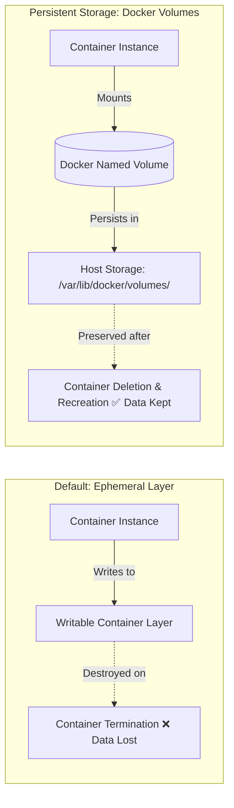
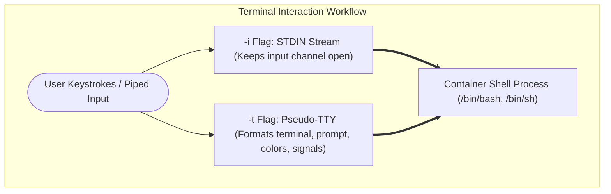
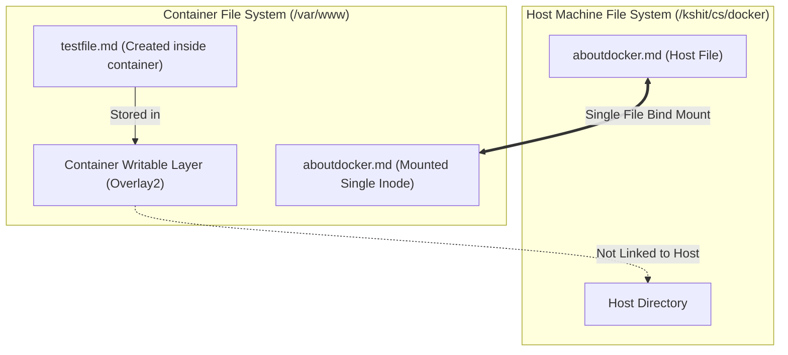
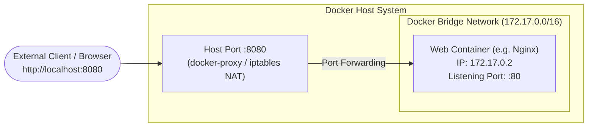
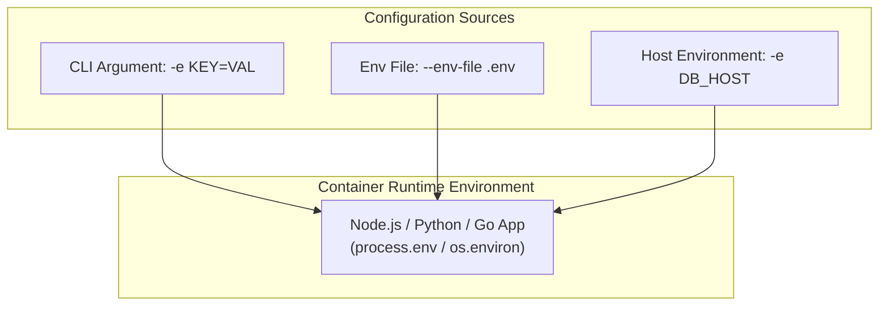
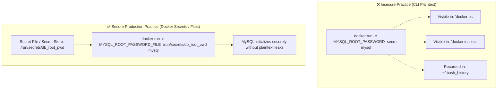
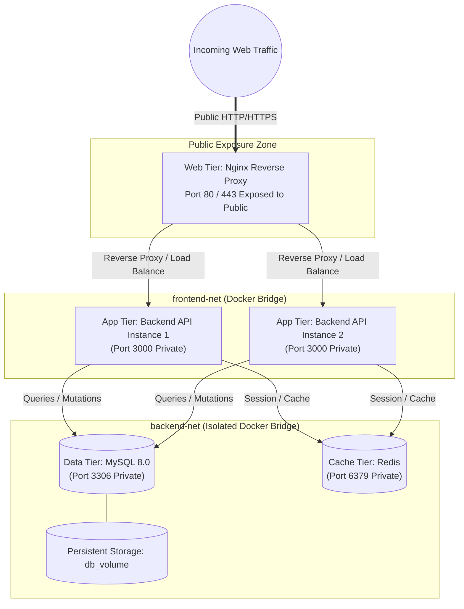

# Docker Miscellaneous Concepts & Real-World DevOps Guide

A comprehensive deep-dive into container inspection, storage mechanisms, interactive shells, bulk container lifecycle management, port forwarding, secrets management, and multi-tier production architectures.

---

## 1. Resource & System Inspection Inside Containers

When troubleshooting containers in staging or production environments, DevOps engineers must inspect the compute and storage resources allocated to the container.

### Inspecting CPU and Memory
Containers share the host operating system kernel and receive compute resources allocated by Linux Control Groups (`cgroups`).

- **`lscpu`**: Displays CPU architecture information (number of CPUs, cores, sockets, threads, virtualization type, and CPU model).
  ```bash
  # Run directly inside an interactive container shell
  lscpu
  ```
- **`nproc`**: Prints the number of processing units available to the current process.
  ```bash
  nproc
  ```
- **`/proc/cpuinfo`**: The virtual filesystem entry containing detailed per-core information:
  ```bash
  cat /proc/cpuinfo
  ```

### Inspecting Disk and Storage Consumption
- **`df -h`**: Reports filesystem disk space usage in human-readable format (`-h` displays sizes in GB/MB).
  ```bash
  df -h
  ```
- **`du -sh <path>`**: Summarizes the total disk usage of a specific folder inside the container:
  ```bash
  du -sh /var/log
  ```

### Docker Host-Level Monitoring
Instead of entering the container, you can monitor resource usage from the host:
```bash
# Real-time streaming metrics (CPU %, Memory Usage / Limit, Network I/O, Block I/O)
docker stats

# View running processes inside a specific container
docker top <container_name_or_id>
```



> [!TIP]
> **DevOps Scenario: Troubleshooting OOM (Out Of Memory) Kills**  
> If your application abruptly crashes with **Exit Code 137**, it was killed by the Linux kernel OOM Killer because it exceeded its memory limit configured via `docker run -m 512m` or Kubernetes resource limits. Use `docker stats` and `docker inspect <container> --format '{{.State.OOMKilled}}'` to identify OOM events.

---

## 2. Container Ephemerality vs Data Persistence (Volumes)

Containers are inherently **ephemeral** (stateless and temporary).



### The Ephemeral Problem
- By default, all files created inside a container are written to a temporary, writable layer managed by the storage driver (`overlay2`).
- When the container is deleted (`docker rm`), this writable layer is **permanently destroyed**. Any databases, user uploads, or session logs written to the local container path vanish.

### The Solution: Docker Volumes & Bind Mounts
To persist data across container lifecycles, Docker provides three primary mounting mechanisms:

| Mount Type | Managed By | Host Location | Recommended Use Case |
| :--- | :--- | :--- | :--- |
| **Named Volumes** | Docker | `/var/lib/docker/volumes/<name>/_data` | Production databases, persistent application state. |
| **Bind Mounts** | User / Host | Any user-specified path (e.g. `/home/user/app`) | Local development (hot-reloading code), configuration files. |
| **tmpfs Mounts** | Host Memory (RAM) | Resides in RAM only (never written to disk) | Sensitive credentials, ultra-fast temporary caches. |

### Practical Volume Commands
```bash
# 1. Create a dedicated persistent volume
docker volume create db_data

# 2. Run a database container attaching the volume
docker run -d \
  --name postgres-prod \
  -v db_data:/var/lib/postgresql/data \
  -e POSTGRES_PASSWORD=securepass \
  postgres:15

# 3. Inspect the host path of the volume
docker volume inspect db_data

# 4. Remove the container (the volume and data remain intact)
docker rm -f postgres-prod

# 5. Spin up a new updated container pointing to the same data
docker run -d \
  --name postgres-prod-v2 \
  -v db_data:/var/lib/postgresql/data \
  postgres:16
```

---

## 3. Interactive Flags Demystified: `-i` vs `-t` vs `-it`

When running containers or executing sub-shells, combining `-i` and `-t` allows user interaction with the process.



### Detailed Breakdown

1. **`-i` (`--interactive`)**:
   - Keeps the container's standard input (`STDIN`) open, even if not attached.
   - Allows passing data and commands into the container's input stream.
   - **Without `-i`**: The container process receives `EOF` (End of File) on STDIN and will not accept typed input.

2. **`-t` (`--tty`)**:
   - Allocates a pseudo-TTY (Teletypewriter), creating a simulated terminal screen.
   - Provides terminal formatting: shell prompt (`root@container:/#`), colorized output, auto-complete, and proper handling of escape sequences (like `Ctrl+C` or `Ctrl+D`).
   - **Without `-t`**: You get raw text streams with no prompt, no cursor positioning, and no ANSI coloring.

3. **`-it` (Combined Interactive TTY)**:
   - Necessary for an interactive shell session where you type commands in real-time.

### Comparison Matrix

| Flag Combination | Terminal Behavior | Common Use Case |
| :--- | :--- | :--- |
| `docker run -it ubuntu bash` | Interactive terminal with prompt, colors, and keyboard input. | Live debugging, administrative shell access. |
| `docker run -i ubuntu bash` | Reads input line-by-line without terminal styling or prompt. | Scripting, piping input directly from host files. |
| `docker run -t ubuntu ls` | Formats output as a TTY, but does not take input. | Pretty-printing container command output. |
| `docker run -d nginx` | Runs completely in the background (Detached). | Long-running production daemons and web services. |

### Real-World DevOps Example: Piped Input with `-i`
When restoring a database dump from your host machine into a container, you need `-i` (to stream the SQL file) but **not** `-t` (since TTY formatting would corrupt raw binary or SQL data streams):

```bash
# Stream host SQL backup directly into containerized MySQL via STDIN
docker exec -i mysql-server mysql -u root -pSecret123 production_db < backup.sql
```

---

## 4. Bulk Container Management & Shell Substitution

In automated CI/CD pipelines or local cleanups, engineers frequently need to perform batch operations on containers.

### Key Docker Query Flags
- **`docker ps`**: Lists running containers.
- **`-a` (`--all`)**: Includes stopped/exited containers.
- **`-q` (`--quiet`)**: Outputs **only numeric container IDs**, omitting table headers and formatting.

### Removing All Containers at Once

#### Linux / macOS (Bash / Zsh Command Substitution)
Using the `$()` subshell evaluation syntax:
```bash
# Force-remove (-f) all containers (both running and stopped)
docker rm -f $(docker ps -a -q)
```

**How it works step-by-step:**
1. `docker ps -a -q` executes first, returning a whitespace-separated list of container IDs (e.g. `a1b2c3d4 e5f6g7h8`).
2. The outer command expands to: `docker rm -f a1b2c3d4 e5f6g7h8`.
3. `-f` (`--force`) sends a `SIGKILL` to running containers before deleting them.

#### Windows PowerShell
```powershell
# PowerShell pipeline equivalent
docker ps -a -q | ForEach-Object { docker rm -f $_ }

# Or concise PowerShell syntax:
docker rm -f $(docker ps -aq)
```

### Modern DevOps Cleanup Best Practices
In modern Docker versions, use native prune commands rather than shell interpolation:
```bash
# Remove all stopped containers safely
docker container prune -f

# Filtered removal: delete only containers that exited with an error (non-zero status)
docker rm $(docker ps -a -q --filter "status=exited")

# Complete system hygiene (stopped containers, unused networks, dangling images, build cache)
docker system prune -f
```

> [!WARNING]
> **Production Safety Warning**  
> Never run `docker rm -f $(docker ps -aq)` on production or shared multi-tenant hosts. It unconditionally terminates every container on the daemon, causing immediate downtime for co-hosted services.

---

## 5. Bind Mounts: Single File Mount vs. Directory Mount

### Case Study Analysis
Consider the following command:
```bash
docker run -it --name li -v /kshit/cs/docker/aboutdocker.md:/var/www/aboutdocker.md centos:7
```

**Question**: If you enter this container and create a new file `/var/www/testfile.md`, will that new file appear on your local host machine outside the container?

**Answer**: **NO, it will NOT appear on the host machine.**



### Technical Explanation
1. **Single File Bind Mount**:
   - The flag `-v /host/path/file.md:/container/path/file.md` binds only that **specific file inode**.
   - Changes made to the contents of `/var/www/aboutdocker.md` inside the container **will** reflect on the host's `/kshit/cs/docker/aboutdocker.md` and vice versa.
2. **Directory Isolation**:
   - The parent directory `/var/www/` inside the container is **not** mounted to the host directory `/kshit/cs/docker/`.
   - When you create `/var/www/testfile.md`, it is written to the container's isolated **writable layer (`overlay2`)**.
   - Because the directory itself is unlinked, the host filesystem is completely unaware of new files created in `/var/www/`.

### How to Synchronize the Entire Folder (Directory Bind Mount)
If your goal is to have all created, edited, and deleted files sync bidirectionally, mount the entire directory:

```bash
# Mounts the whole host directory to /var/www inside the container
docker run -it --name li -v /kshit/cs/docker:/var/www centos:7
```
Now, any file created inside `/var/www/` (such as `touch /var/www/testfile.md`) will instantly appear on your host machine in `/kshit/cs/docker/testfile.md`.

> [!NOTE]
> **DevOps Use Case: Hot-Reloading in Development**  
> Developers bind mount the entire source code directory (`-v $(pwd):/app`) during local development so that code edits in VS Code immediately trigger hot-reloading inside the container without rebuilding the image.

---

## 6. Port Publishing and Forwarding (`-p` / `-P`)

Containers run inside isolated network namespaces with private IP addresses. To make a containerized service accessible from the host machine or external internet, you must publish its ports.



### Syntax and Mechanics
```bash
-p [HOST_IP:][HOST_PORT]:CONTAINER_PORT[/PROTOCOL]
```
- **`HOST_PORT`**: The port opened on your physical or virtual host machine.
- **`CONTAINER_PORT`**: The private port that the application inside the container is listening on.

### Common Examples & Configurations

```bash
# 1. Standard port forwarding (Host 8080 -> Container 80)
docker run -d --name web -p 8080:80 nginx

# 2. Binding to a specific host IP (Security Best Practice)
# Listens only on loopback interface; blocks public external access
docker run -d --name db -p 127.0.0.1:5432:5432 postgres:15

# 3. Dynamic / Ephemeral host port assignment
# Docker randomly assigns an available high-range host port (e.g., 32768)
docker run -d --name test-app -p 80 nginx

# 4. UDP Port Forwarding (e.g. DNS or gaming servers)
docker run -d --name dns-server -p 53:53/udp coredns

# 5. Publish all exposed ports defined in the Dockerfile (-P)
docker run -d -P nginx
```

### Verifying Port Bindings
```bash
# List all mapped ports for a container
docker port web
# Output: 80/tcp -> 0.0.0.0:8080
```

---

## 7. Environment Variables (`-e`, `--env`, `--env-file`)

Following the **12-Factor App methodology**, applications should strictly separate configuration from code. Docker allows dynamic runtime configuration using environment variables.



### Usage Patterns

1. **Passing Single Key-Value Pairs (`-e`)**:
   ```bash
   docker run -d \
     --name api-server \
     -e NODE_ENV=production \
     -e PORT=3000 \
     my-node-api
   ```

2. **Passing Host Environment Variables**:
   If you omit the `=value`, Docker pulls the value directly from your host shell:
   ```bash
   export AWS_REGION="us-west-2"
   docker run -e AWS_REGION my-app
   ```

3. **Using Environment Files (`--env-file`)**:
   For applications requiring dozens of configuration parameters, define them in a `.env` file:
   ```ini
   # production.env
   APP_ENV=production
   LOG_LEVEL=info
   CACHE_TTL=3600
   API_TIMEOUT=5000
   ```
   Run the container with the file attached:
   ```bash
   docker run -d --env-file production.env my-node-api
   ```

---

## 8. Database Containers & Secrets Management: The MySQL Case Study

Running stateful database images like MySQL or MariaDB introduces critical security and initialization requirements.



### The MySQL Image Initialization Requirement
If you attempt to run the official MySQL image without configuration:
```bash
docker run -d --name mysql-fail mysql:8.0
```
The container will immediately crash and terminate with an error in `docker logs`:
> `[ERROR] [Entrypoint]: Database is uninitialized and password option is not specified. You need to specify one of MYSQL_ROOT_PASSWORD, MYSQL_ALLOW_EMPTY_PASSWORD, or MYSQL_RANDOM_ROOT_PASSWORD.`

To start properly, MySQL requires one of the initialization variables:
```bash
docker run -d \
  --name mysql-dev \
  -e MYSQL_ROOT_PASSWORD=mySuperSecretPassword123 \
  -e MYSQL_DATABASE=production_db \
  -e MYSQL_USER=appuser \
  -e MYSQL_PASSWORD=appuserpassword \
  -v mysql_data:/var/lib/mysql \
  mysql:8.0
```

### The Security Vulnerability: Plaintext Password Exposure
Passing sensitive credentials via `-e MYSQL_ROOT_PASSWORD` in production or CI/CD pipelines creates severe security risks:
1. **Process Inspection**: Anyone with host access can view the password via `docker inspect <container_id>`.
2. **Process Table**: Visible in `ps aux` and process listings.
3. **Shell History**: Plaintext passwords are permanently recorded in `~/.bash_history` or CI build logs.

### Enterprise Solution: Using `_FILE` Environment Variables & Docker Secrets
Official database images (MySQL, Postgres, MariaDB) support the `_FILE` suffix to read credentials from mounted secret files rather than plaintext environment variables:

```bash
# 1. Store secret in a restricted file on the host
echo "SuperSecureRootPassword987!" > /secrets/mysql_root_password.txt
chmod 600 /secrets/mysql_root_password.txt

# 2. Mount the secret file and pass the _FILE variable
docker run -d \
  --name mysql-secure \
  -v /secrets/mysql_root_password.txt:/run/secrets/mysql_root_pwd:ro \
  -e MYSQL_ROOT_PASSWORD_FILE=/run/secrets/mysql_root_pwd \
  -e MYSQL_DATABASE=ecommerce \
  -v mysql_prod_data:/var/lib/mysql \
  mysql:8.0
```

---

## 9. Multi-Tier Architecture in Docker

In modern software engineering, scalable web applications are decoupled into multiple independent tiers (layers), typically:
1. **Web / Presentation Tier**: Reverse proxy / Load balancer (Nginx, Traefik).
2. **Application / API Tier**: Backend microservices (Node.js, Go, Python, Java).
3. **Data / Storage Tier**: Relational databases (MySQL, PostgreSQL) and in-memory caches (Redis).



### Architectural Principles of Containerized Multi-Tier Systems
1. **Network Segmentation & Isolation**:
   - The Database and Cache containers **must never** expose ports to the public host.
   - The Web tier cannot directly communicate with the database tier (they reside on separate custom bridge networks).
   - Only the Application tier connects to both `frontend-net` and `backend-net`.
2. **Service Discovery (DNS Resolution)**:
   - On custom Docker bridge networks, containers resolve each other using their container names as hostnames (e.g. `mysql://db:3306`), eliminating hardcoded IP addresses.
3. **Data Durability**:
   - Database storage is backed by named volumes (`mysql_data`), surviving container destruction and updates.

### Production Multi-Tier Deployment Example (`docker-compose.yml`)

```yaml
version: '3.8'

networks:
  frontend-tier:
    driver: bridge
  backend-tier:
    driver: bridge

volumes:
  db_data:
    driver: local
  redis_data:
    driver: local

services:
  # ---------------------------------------------
  # 1. WEB TIER (Reverse Proxy & Ingress)
  # ---------------------------------------------
  web:
    image: nginx:alpine
    container_name: web-proxy
    restart: always
    ports:
      - "80:80"
      - "443:443"
    volumes:
      - ./nginx.conf:/etc/nginx/nginx.conf:ro
    networks:
      - frontend-tier
    depends_on:
      - api

  # ---------------------------------------------
  # 2. APPLICATION TIER (Backend Microservice)
  # ---------------------------------------------
  api:
    image: my-node-backend:1.0.0
    container_name: api-service
    restart: always
    environment:
      - NODE_ENV=production
      - DB_HOST=db
      - DB_USER=app_user
      - DB_PASSWORD_FILE=/run/secrets/db_password
      - REDIS_HOST=cache
    networks:
      - frontend-tier
      - backend-tier
    depends_on:
      - db
      - cache

  # ---------------------------------------------
  # 3. DATA TIER (MySQL Database & Redis Cache)
  # ---------------------------------------------
  db:
    image: mysql:8.0
    container_name: mysql-db
    restart: always
    environment:
      - MYSQL_DATABASE=app_production
      - MYSQL_USER=app_user
      - MYSQL_PASSWORD=UserSecurePass123!
      - MYSQL_ROOT_PASSWORD=RootSuperSecurePass456!
    volumes:
      - db_data:/var/lib/mysql
    networks:
      - backend-tier

  cache:
    image: redis:7-alpine
    container_name: redis-cache
    restart: always
    volumes:
      - redis_data:/data
    networks:
      - backend-tier
```

### Deploying and Validating the Multi-Tier Stack
```bash
# 1. Deploy all tiers in detached mode
docker compose up -d

# 2. Verify network segmentation and running services
docker compose ps

# 3. Test service discovery from inside the API container
docker compose exec api ping -c 2 db

# 4. Verify that the database is NOT accessible from the host directly
nc -zv 127.0.0.1 3306   # Connection refused (Properly isolated!)
```

---

## 10. Summary Cheat Sheet

| Topic | Key Command / Flag | DevOps Best Practice |
| :--- | :--- | :--- |
| **System Inspection** | `lscpu`, `df -h`, `docker stats` | Monitor cgroup limits and watch for Exit Code 137 (OOM kills). |
| **Data Persistence** | `-v <volume_name>:/path` | Use named volumes for production DBs; avoid writing to ephemeral layer. |
| **Interactive Terminal**| `-it` vs `-i` | Use `-it` for interactive shells; use `-i` (no `-t`) when piping binary/SQL scripts. |
| **Batch Cleanup** | `docker rm -f $(docker ps -aq)` | Use `docker container prune` in automation to prevent accidental production drops. |
| **Bind Mounts** | `-v /host/dir:/container/dir` | Mounting a single file syncs only that file; mount whole directory for tree sync. |
| **Port Mapping** | `-p 127.0.0.1:8080:80` | Bind internal services to `127.0.0.1` to prevent unintentional exposure to the public web. |
| **Secrets & Env** | `MYSQL_ROOT_PASSWORD_FILE` | Never pass plaintext secrets via `-e` in CI/CD; use files or Docker Secrets. |
| **Multi-Tier Architecture** | Custom Bridge Networks | Segment Web, App, and Data layers on separate networks; isolate DBs from public ingress. |
